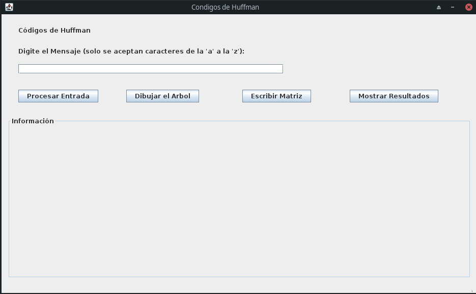
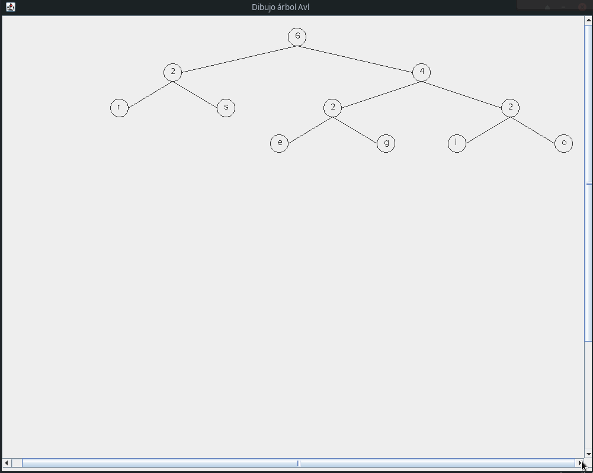
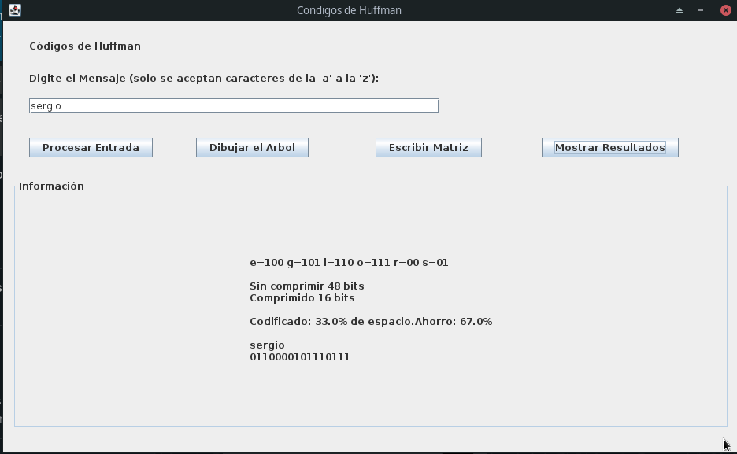

# Codigo Huffman

Programa de implementación de los arboles de Huffman para encriptar un mensaje y reducir su almacenamiento. 

## Ejecución en modo desarrollo

Puede ejecutar el script de bash para automatizar la compilación y ejecución del proyecto

```console
sh dev.sh
```

O compilarlo de manera manual con java 

```console
cd src

javac Main.java -d ../<output-dir>

cd ../<output-dir>

java Main
```

## Capturas del programa






